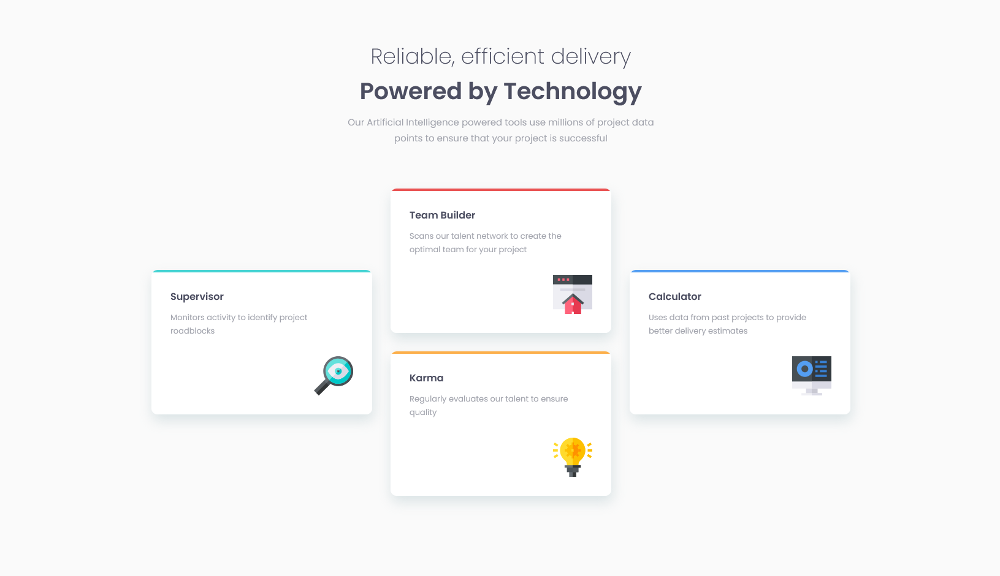
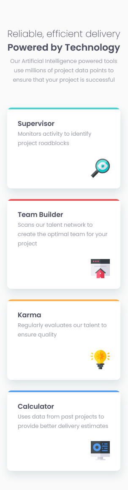

# Frontend Mentor - Four card feature section solution

This is a solution to the [Four card feature section challenge on Frontend Mentor](https://www.frontendmentor.io/challenges/four-card-feature-section-weK1eFYK). Frontend Mentor challenges help you improve your coding skills by building realistic projects.

## Table of contents

- [Overview](#overview)
  - [The challenge](#the-challenge)
  - [Screenshots](#screenshots)
    - [Screenshot desktop](#screenshot-desktop)
    - [Screenshot mobile](#screenshot-mobile)
  - [Links](#links)
  - [Built with](#built-with)
- [Author](#author)

## Overview

### The challenge

Users should be able to:

- View the optimal layout for the site depending on their device's screen size

### Screenshot

#### Screenshot desktop

#### Screenshot mobile

### Links

- Solution URL: [https://michallides.github.io/four-card-feature-section-master_FM/](https://michallides.github.io/four-card-feature-section-master_FM/)
- Live Site URL: [Add live site URL here](https://your-live-site-url.com)

### Built with

- Semantic HTML5 markup
- CSS Grid

## Author

- Frontend Mentor - [@michallides](https://www.frontendmentor.io/profile/michallides)
- Github - [@michallides](https://github.com/michallides)
